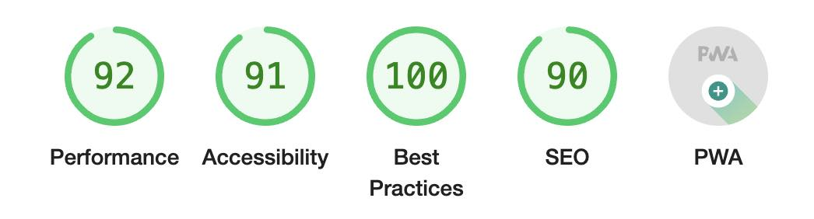

# Sample reveal-md with Twemoji

[I explain everything in these two](https://lacourt.dev/2019/03/12/) [blog posts](https://lacourt.dev/2019/03/14/)

## Fake Logo and banner

I made a logo with crappy transparency.

I also made a stupid gradient banner.

## CI/CD

Choose your player:
- [Static site hosted on GitLab Pages, built via GitLab CI](.gitlab-ci.yml) 
- [Static site hosted on GitHub Pages, built via GitHub Actions](.github/workflows/main.yml)
- [Live server running on Heroku, serving the site](Procfile)

## PWA

I made a [Pull Request](https://github.com/webpro/reveal-md/pull/405) to add options to inject what is needed to transform the presentation into a Progressive Web App :

- custom web manifest (if you test locally, set the `start_url` to `http://localhost:8000` or whatever port you're using)
- custom service worker

And I will also add those later:
- meta description
- meta theme-color

With these changes, the app gets a decent LightHouse report in the PWA section.

